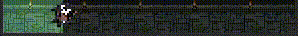
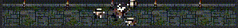
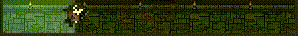

# Tica Dungeon Progress Bar

Replace JetBrains Rider's progress bars with a pixel-art dungeon-crawler animation
starring **Tica the orca warrior**. Indexing, building, plugin updates — every progress
bar in Rider becomes a tiny adventure.



## Stages

Progress percent maps to a dungeon depth and a hero outfit:

| Range | Stage | Hero outfit |
|---|---|---|
| 0–25% | Cellar | Cloth tunic + short sword |
| 26–60% | Ruins | Silver armour + cape + longsword |
| 61–95% | Core | Golden armour + flame sword + battle aura |
| 96–100% | Treasury | Victory pose, chest opens with "LOOT FOUND" |

From 70% onward the boss — a giant red bug — appears on the right side and visibly
collapses through 4 frames as the bar fills.

## Special modes

**Indeterminate** — Tica fights three orbiting skeletons:



**Critical hit** — when progress jumps by ≥20% in one update, a "CRITICAL!" pop-up
bounces over the hero:



## Requirements

- JetBrains Rider 2024.2 or newer.

Verified on 2024.2 sandbox, 2025.1 sandbox, and Rider 2026.1 (production install).

## Install

### From a `.zip` (sideload)

1. Download `rider-dungeon-progress-X.Y.Z.zip` (from releases or build it yourself).
2. In Rider: **Settings → Plugins → ⚙ → Install Plugin from Disk…**
3. Pick the zip; restart Rider.

### From the JetBrains Marketplace

Search for **"Tica Dungeon Progress Bar"** in **Settings → Plugins → Marketplace**.

## Build from source

```
./gradlew buildPlugin
```

Output: `build/distributions/rider-dungeon-progress-*.zip`

Run a sandbox Rider with the plugin pre-installed:

```
./gradlew runIde
```

## Asset pipeline

Source PNGs live in [`assets-source/`](assets-source/). The pre-build script
`tools/resize_assets.py` downsamples them with nearest-neighbour resampling and removes
white backgrounds via 4-corner flood-fill, writing the optimized assets into
`src/main/resources/assets/`.

```
py tools/resize_assets.py
```

Re-run this whenever you change anything under `assets-source/`. Both the source PNGs
and the resized output are committed so a fresh clone can build without running the
pipeline.

## Limits / known issues

- Some Rider progress widgets are driven by the ReSharper backend and bypass Swing's
  `JProgressBar` entirely. Those keep the default look.

## License

MIT — see `LICENSE`.
